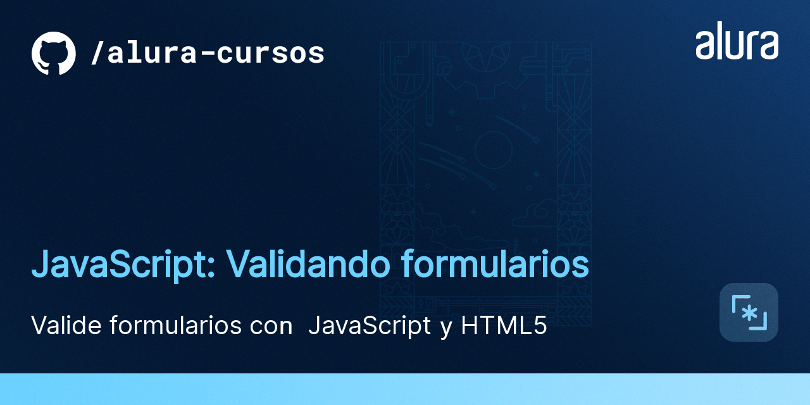
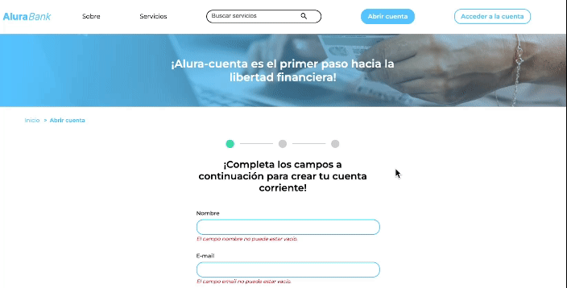
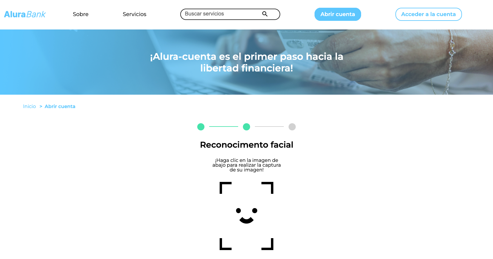
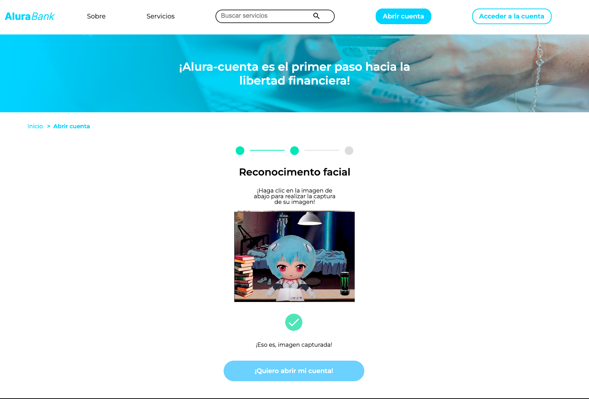
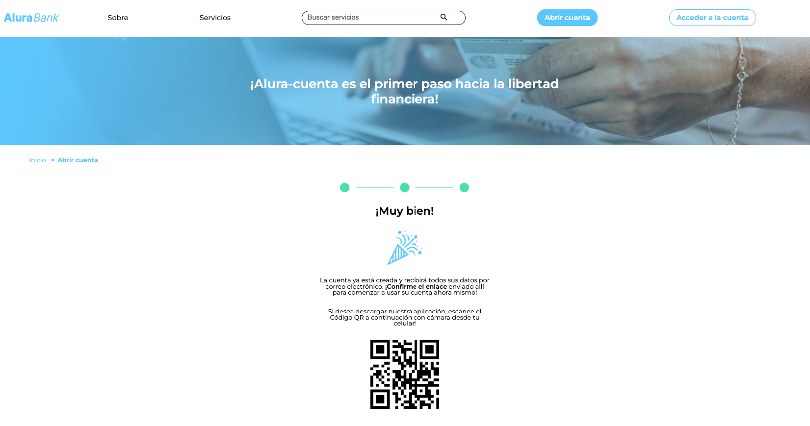

  

  

Formulario de creación de cuenta para el banco virtual AluraBank.

  

Reconocimiento facial.

  

Toma de foto.

  

Registro exitoso.

## Tecnologías utilizadas durante el curso
* JavaScript

## Tecnologías utilizadas en el proyecto
* HTML
* CSS
